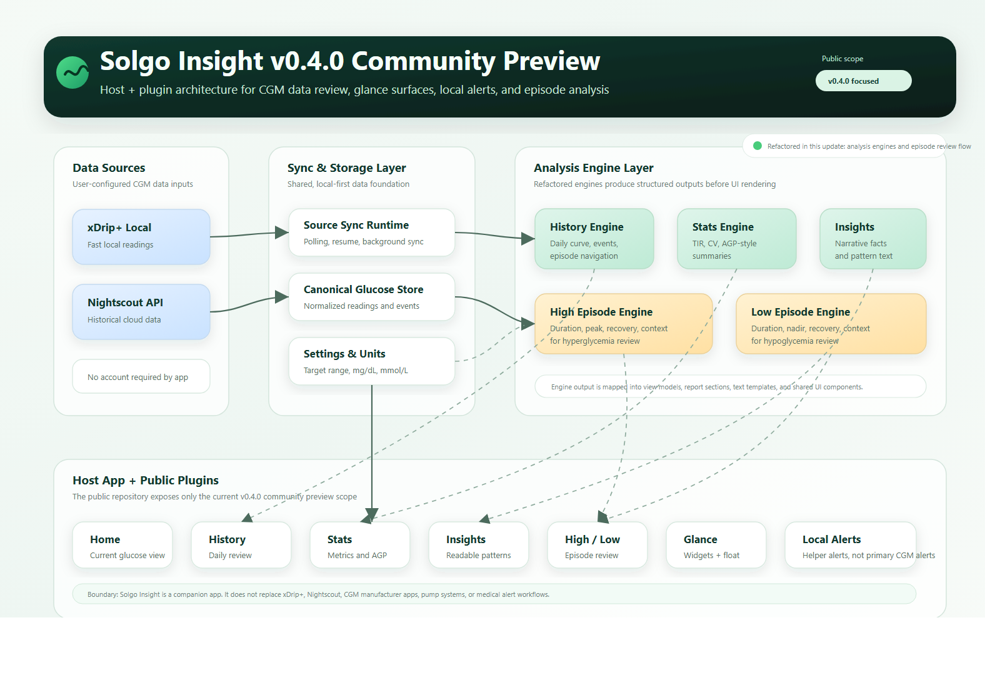
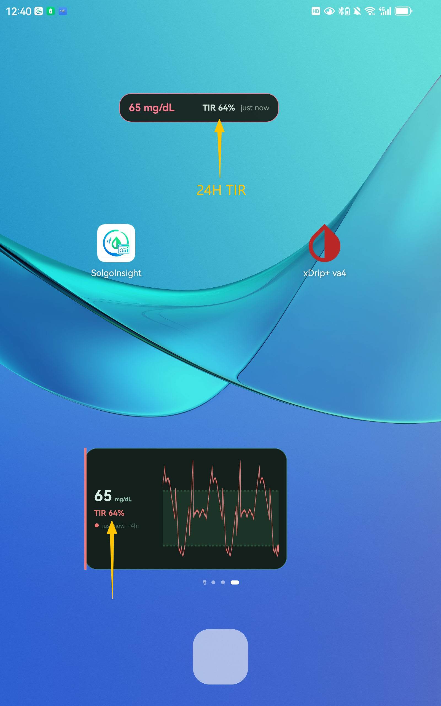
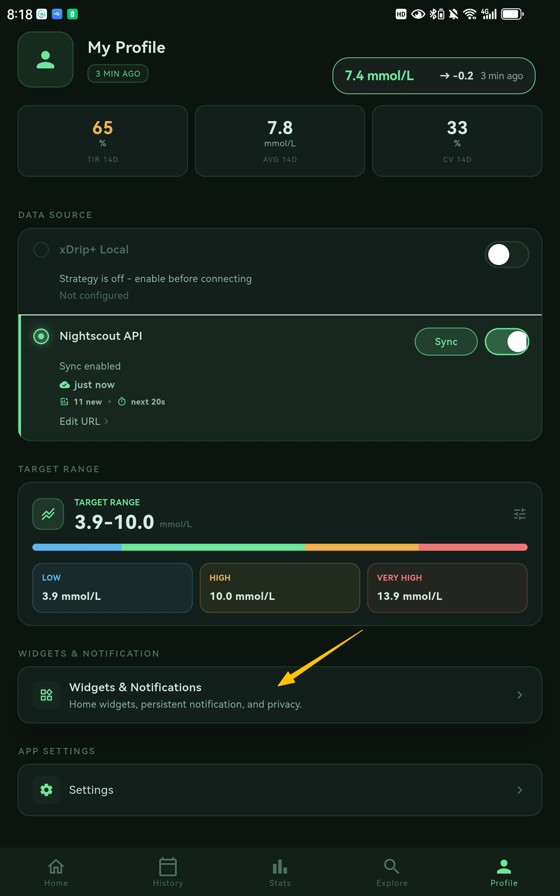
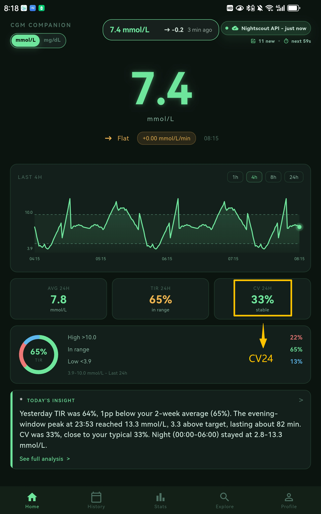
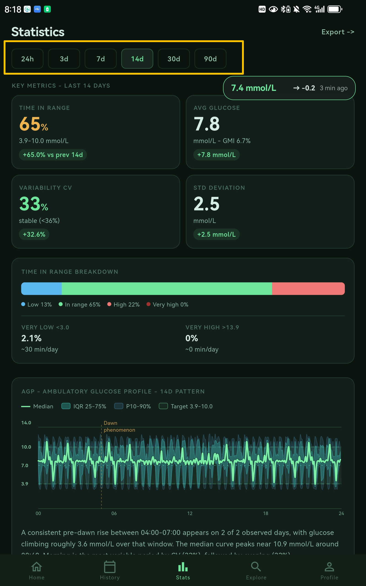

# Solgo Insight Community Preview

**Solgo Insight is an open-source CGM companion app for people who already use
[xDrip+](https://github.com/NightscoutFoundation/xDrip) and
[Nightscout](https://github.com/nightscout/cgm-remote-monitor).**

It helps users review, understand, and discuss the glucose data they already
collect. Solgo Insight is not an official xDrip+ project, not a fork of xDrip+,
and not a replacement for xDrip+, Nightscout, CGM manufacturer apps, pump
systems, or medical alert workflows.

> Previously published under an earlier preview name. The project was renamed
> to Solgo Insight to make its companion-app position clearer.

## Download

**Latest Android APK:**  
https://github.com/solgosea/solgo-glucose-insight/releases/download/v0.4.0-community-preview/solgo-insight-community-preview-v0.4.0-android.apk

Latest preview: **v0.4.0 Community Preview**

## Community

Solgo Insight is shaped by community feedback.

Join the Reddit community to share feedback, report issues, discuss feature
ideas, and follow updates:

https://www.reddit.com/r/SolgoInsight/

## What This Update Is About

This update is mainly an **architecture-focused community preview update**.

The public repository has been refreshed around the current v0.4.0 scope, with
larger internal changes to the way analysis features are organized.

The main direction is:

- Keep the public code aligned with the features already described to the community.
- Separate data analysis logic from UI pages.
- Move feature logic toward clearer engine, mapper, runtime, and UI boundaries.
- Make History, Stats, Insights, High Episode, and Low Episode easier to evolve independently.
- Keep unreleased or experimental plugins out of the public preview repository.

## Architecture

Solgo Insight is built around a **host + plugin architecture**.

The host app provides shared foundations such as data source coordination,
sync runtime, local storage, app settings, unit conversion, plugin lifecycle,
background runtime, and alert runtime foundation.

Feature plugins then build user-facing experiences on top of those shared
services.



In this version, the data analysis flow is moving toward:

```text
xDrip+ Local / Nightscout
        |
        v
Sync & Storage Layer
        |
        v
Analysis Engines
        |
        v
View Models / Text / Report Sections
        |
        v
Plugin UI and Glance Surfaces
```

This structure is important because Solgo Insight is expected to grow through
real community feedback. A clearer architecture makes it easier to add,
improve, or remove features without turning the app into a tightly coupled set
of screens.

For more details, see [Architecture Notes](docs/architecture.md).

## Current Preview Scope

The current public preview includes:

- Home view with current glucose, trend, range, TIR, and quick insights.
- History view with daily review, chart inspection, and high/low episode entry points.
- Stats view for TIR, variability, AGP-style overview, and selectable time windows.
- Insights view for readable glucose pattern summaries.
- High Episode and Low Episode analysis.
- xDrip+ Local and Nightscout data source setup.
- Background sync foundation for keeping data fresh.
- Local glucose alert engine, disabled by default.
- Glance Layer: Android widgets, floating glance, and lock-screen friendly notification text.

The public repository intentionally does **not** include unreleased or
experimental plugins outside this preview scope.

## History and Episode Review

The latest code update improves the analysis foundation behind History,
High Episode, and Low Episode.

History is moving toward a daily review surface rather than only a simple list
or chart. It is designed to help users answer practical questions such as:

- What happened today?
- When did glucose move out of range?
- What was the glucose value at a specific point on the chart?
- Which high or low episode needs closer review?

High Episode and Low Episode analysis are also being organized around clearer
engine outputs, including episode duration, peak or nadir, recovery behavior,
context, and repeat-pattern review.

These observations are for personal review and discussion only. They are not
medical advice.

## Glance Layer

The Glance Layer is designed for quick daily access to current glucose status.

It includes:

- Android home screen widgets.
- Floating Glance for checking glucose over other apps.
- Lock-screen friendly notification text.
- Compact status views for current glucose, trend, delta, update time, and 24h TIR.

Floating Glance requires Android overlay permission. On some devices, users may
need to allow Solgo Insight to display over other apps.

## Screenshots

| Floating glance with 24h TIR | Floating widget preview |
| --- | --- |
|  |  |

| Home 24h CV | Stats time windows |
| --- | --- |
|  |  |

## Data Source Setup

Solgo Insight can use xDrip+ Local or Nightscout as data sources.

For xDrip+ Local setup, see the
[xDrip+ Local Connection Guide](docs/xdrip-local-connection-guide.md).

## Demo

**Demo video:**  
https://www.youtube.com/watch?v=UfjxgaeEwZA

**Playlist:**  
https://www.youtube.com/watch?v=QZl0NSckXYI&list=PLKDhx_9jUu-74px9PGC62dwRQwsXWhLxi

## FAQ

Have questions about local xDrip+ data, Nightscout, widget sizes, delta
differences, or whether Solgo Insight replaces xDrip+?

See the [Solgo Insight FAQ](docs/faq.md).

## Privacy

- No Solgo Insight account is required.
- Glucose data is stored locally on the device.
- Network calls are made only to data sources you configure, such as xDrip+
  Local or your own Nightscout site.
- This repository does not include telemetry or advertising SDKs.

## Medical Disclaimer

Solgo Insight is not a medical device. It is for personal data review,
education, and community feedback. Do not make treatment decisions based only
on this app. Always follow your care plan and consult qualified healthcare
professionals.

## Development

```bash
flutter pub get
flutter run -d android
```

This public preview is Android-first.
